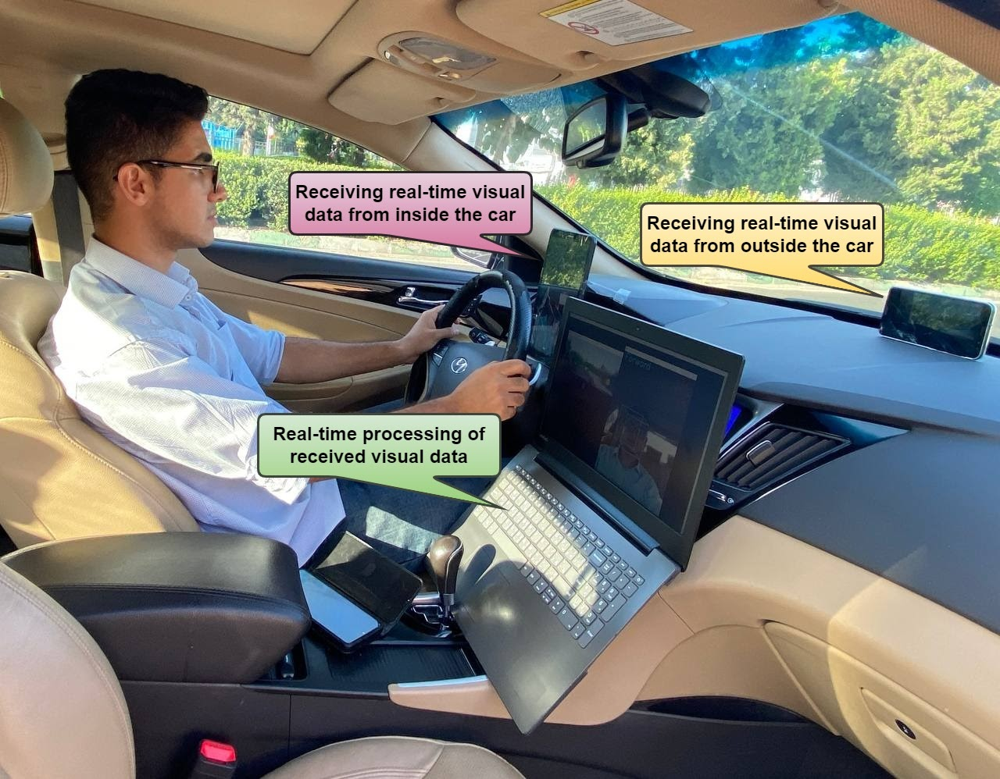
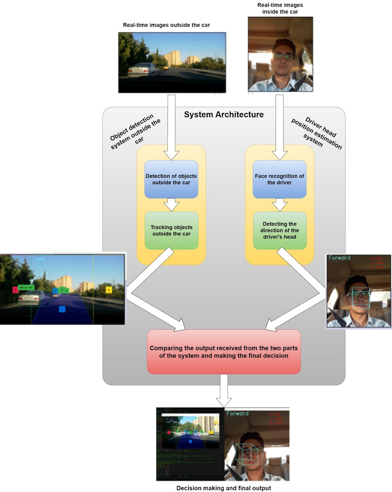

# Behavior Analysis of Car Drivers Based on Computer Vision

Documentation-first repository for an Advanced Driver Assistance System (ADAS) prototype that combines outside-scene perception and in-cabin driver monitoring to improve real-time driving safety.

> Current status: this repository contains the project description, system design, media assets, and demonstration links. Source code is not published in this repository yet.

Project webpage: [amir-sbg.github.io/driver-behavior](https://amir-sbg.github.io/driver-behavior/)

## Overview

This project studies how computer vision can support safer driving by jointly analyzing:

- The road scene outside the vehicle, including surrounding objects, pedestrians, traffic signals, and motion patterns.
- The driver inside the vehicle, especially head direction and attention-related cues.
- The relationship between external hazards and the driver's current attention state.

The system is designed as a dual-stream perception pipeline. One stream processes forward-facing road imagery for object detection and motion tracking. The second stream processes in-cabin imagery for face localization and head-direction estimation. Their outputs are then fused by a decision layer that can trigger voice-based warnings such as drowsiness alerts, traffic-light notifications, pedestrian warnings, and side-hazard prompts.



## Technical Summary

| Module | Role | Computer Vision Method |
| --- | --- | --- |
| Exterior object perception | Detect vehicles, pedestrians, traffic lights, and other road-scene objects | YOLOv8 object detection |
| Exterior motion reasoning | Track detected objects and estimate motion across frames | Optical flow |
| Driver face localization | Detect the driver's face in the in-cabin camera stream | SSD-based face detector |
| Head-direction estimation | Estimate whether the driver is looking forward, left, right, or away | Face-region analysis and head-pose cues |
| Decision fusion | Combine road-scene context with driver-attention context | Rule-based safety logic |
| Voice assistant | Convert system decisions into real-time driver alerts | Audio warning interface |

## Demonstrations

The six project demos are included as MP4 assets in this repository. If a browser does not show the embedded player inside GitHub, use the local MP4 or Google Drive mirror link under each demo.

### Head Direction Detection

In-cabin driver monitoring using face detection and head-direction estimation.

<video src="assets/videos/head-direction-detection.mp4" controls width="100%"></video>

[Local MP4](assets/videos/head-direction-detection.mp4) | [Google Drive mirror](https://drive.google.com/file/d/1A2q3yyOWNahFMdCXNqwSgLiplSm0I8R8/view?usp=sharing)

### Object Detection and Tracking

Outside-scene object detection with temporal motion tracking.

<video src="assets/videos/object-detection-tracking.mp4" controls width="100%"></video>

[Local MP4](assets/videos/object-detection-tracking.mp4) | [Google Drive mirror](https://drive.google.com/file/d/10NZdcjuLJwZpQkWyuejilv89bkpzwO8w/view?usp=sharing)

### Wake Up Alert

Detects drowsiness or inattention and triggers an alert for the driver.

<video src="assets/videos/wake-up-alert.mp4" controls width="100%"></video>

[Local MP4](assets/videos/wake-up-alert.mp4) | [Google Drive mirror](https://drive.google.com/file/d/1OBGQBOWgTtPI4M-Lg9MHks1ceZ5gpF04/view?usp=sharing)

### Traffic Light Alert

Identifies traffic lights ahead and reports relevant driving context.

<video src="assets/videos/traffic-light-alert.mp4" controls width="100%"></video>

[Local MP4](assets/videos/traffic-light-alert.mp4) | [Google Drive mirror](https://drive.google.com/file/d/1SKdeQcPozlHjiXv1Xai9ZFWGEwpoZ0t2/view?usp=sharing)

### Pedestrian Alert

Detects pedestrians near the vehicle to support safer navigation.

<video src="assets/videos/pedestrian-alert.mp4" controls width="100%"></video>

[Local MP4](assets/videos/pedestrian-alert.mp4) | [Google Drive mirror](https://drive.google.com/file/d/175rLPKxnW_U6EwKj4D845NgkOWCcjafd/view?usp=sharing)

### Look Left Alert

Warns the driver about a hazard approaching from the left side.

<video src="assets/videos/look-left-alert.mp4" controls width="100%"></video>

[Local MP4](assets/videos/look-left-alert.mp4) | [Google Drive mirror](https://drive.google.com/file/d/1Xo7zvCDjAGA3eRQL3tgdRpmuObn_qE4a/view?usp=sharing)

## System Architecture

The architecture uses two synchronized visual inputs:

1. A forward-facing camera that observes the road scene outside the car.
2. An in-cabin camera that observes the driver's face and head direction.

The outside stream detects and tracks objects in the driving environment. The inside stream detects the driver's face and estimates attention direction. The final decision layer compares the outputs of both streams and decides whether an alert should be issued.



## Repository Structure

```text
.
|-- README.md
|-- assets/
|   |-- media/
|   |   |-- driver-behavior-intro.jpg
|   |   `-- system-architecture.jpg
|   `-- videos/
|       |-- head-direction-detection.mp4
|       |-- look-left-alert.mp4
|       |-- object-detection-tracking.mp4
|       |-- pedestrian-alert.mp4
|       |-- traffic-light-alert.mp4
|       `-- wake-up-alert.mp4
`-- docs/
    |-- media-catalog.md
    |-- project-status.md
    `-- system-overview.md
```

## Documentation

- [System overview](docs/system-overview.md): detailed explanation of the perception and decision pipeline.
- [Media catalog](docs/media-catalog.md): complete list of images and demos used by the project page.
- [Project status](docs/project-status.md): what is included now and what can be added in future releases.

## Project Scope

This repository is currently intended to present the project clearly for academic, portfolio, and review purposes. It documents the idea, media, and system design without publishing implementation code, trained weights, datasets, or reproducibility scripts.

## Safety Note

This project is an academic computer vision prototype. It is not a production-ready ADAS product and should not be used as a substitute for certified automotive safety systems.

## License and Reuse

No open-source license has been specified yet. Until a license is added, the project description, media, and future code remain under the author's default copyright.

## Author

Amir Sabbaghziarani

- Website: [amir-sbg.github.io](https://amir-sbg.github.io/)
- Project page: [Behavior Analysis of Car Drivers Based on Computer Vision](https://amir-sbg.github.io/driver-behavior/)
